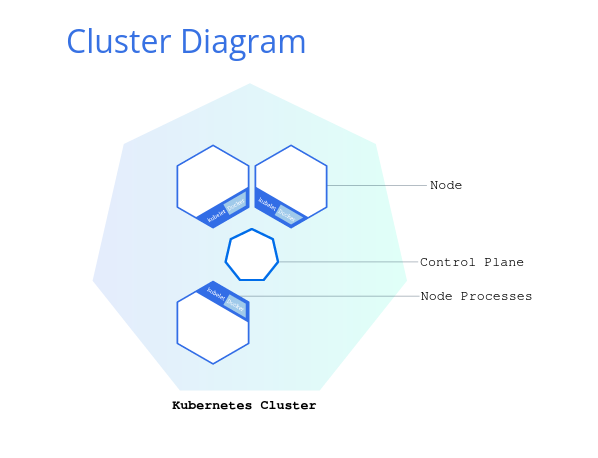
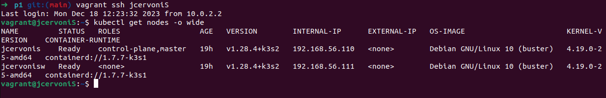
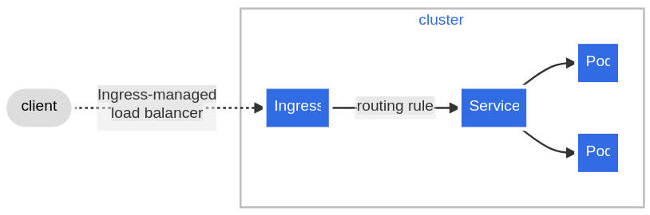

<h1>Inception of Things</h1>

<details>
<summary><b>Part one</b></summary>
<br>

We need to set up two virtual machines with *vagrant* and install <b>K3s</b> respectively in <b>controller mode</b> and <b>agent mode</b> (server and worker).:
<ul>
	<li>first one as <b>Server</b> (-> sufixed with 'S')</li>
	<li> second as <b>Server Worker</b> (-> sufixed with 'SW')</li>
</ul>

We must have dedicated IP on <b>eth1</b> interface:
<ul>
	<li>Server will be on <b>192.168.56.110</b></li>
	<li>Worker will be on <b>192.168.56.111</b></li>
</ul>

We also must be able to connect with ssh on both machine with <b>no password</b>.

After doing that, we have to setup k3s cluster:<br>
<br>


<br>
After setting up our Vagrantfile, we connect to the server node and can see machines are ready with right role and address:<br>

```shell
vagrant up
vagrant ssh jcervoniS
kubectl get nodes -o wide
```
<br>

</details>
<details>
<summary><b>Part two</b></summary>

In this part we have to deploy 3 apps in <b>*one*</b> cluster.<br>
We will have to respect 3 points here:
<ul>
	<li>the 3 apps should be reachable at the same ip address, with a different HOST</li>
	<li>app 2 should have 3 replicas</li>
	<li>by default if no host is provided we should reach app 3</li>
</ul>

Each app will be configured in a \<*app_name*\><b>.yml</b> file, we'll do the same for services and network.<br>
Architecture example:<br>
```
p2/
| --- Vagrantfile
| --- app1.yml
| --- app2.yml
| --- app3.yml
| --- services.yml
| --- ingress.yml
```
So far we have to do it in three steps:
<ul>
	<li>Deploy pods</li>
	<li>Expose pods over a network (Services)</li>
	<li>Control how web traffic reach workload (Ingress)</li>
</ul>
___<br>
<h3>Deployment</h3>

Deployment can be done an easy way with a <b>.yml</b> file. We have to specify the specs of the pods as *label*, number of *replicas* and choose which app will run in the container (aka *image*).<br>
Here is an example of an app deployment file:<br>
```yml
apiVersion: apps/v1
kind: Deployment
metadata:
  name: app-one
spec:
  replicas: 1
  selector:
    matchLabels:
      app: app-one
  template:
    metadata:
      labels:
        app: app-one
    spec:
      containers:
      - name: hello-kubernetes
        image: paulbouwer/hello-kubernetes:1.10
        ports:
        - containerPort: 8080
        env:
        - name: MESSAGE
          value: "Hello from app1"
```

<h3>Expose app</h3>

Exposing an app can be done by setting up a <b>Service</b>. With Kubernetes, pods deployed in a cluster will be created and can also die.<br>
Service is an abstract way to describe a pod/set of pods that can be reachable, without taking care of the IP address of pods, at any time of their cycle of life.<br>
So far we have to create a service (a REST object):<br>
```yml
apiVersion: v1
kind: Service
metadata:
  name: app-one
spec:
  type: ClusterIP
  selector: 
    app: app-one
  ports:
  - port: 80
    targetPort: 8080
```
As we can see we only have to tag an app (label), and specify a couple of ports (server/pod). We also define the type of service we want.<br>
In this case, <b>Cluster-IP</b> allow the pod to b reachable only fro the inside of the cluster. That means that a client who tries to ask for this service/app <br>will comunicate only with the server node, and server node will communicate with the rest of the cluster.

<h3>Web traffic control</h3>

Last part of the cluster's configuration. So far we have:<br>
- a server node, acting like a proxy;
- app deployed in cluster;
- services that describe app in cluster.

We now need to define rules to manage external access to services and provide load-balance.<br>
Ingress will expose routes outside the cluster to services within the cluster.<br>
With ingress, we will be able to act like a DNS, and set a bunch of rules which will manage redirections like this schema from official documentation:<br><br>
<br><br>
Routing rules can be defined severla ways, here we'll use *paths* and *hosts*:
```yml
apiVersion: networking.k8s.io/v1
kind: Ingress
metadata:
  name: iotp2-ingress
spec:
  rules:
  - host: app1.com
    http:
      paths:
        - path: /
          pathType: Prefix
          backend:
            service:
              name: app-one
              port:
                number: 80
```
Now <b>app1</b> is available on route <b>http://*<ip_address>*/app1.com</b> on port 80.
</details>
<details>
<summary><b>Part three</b></summary>
</details>

<details>
<summary><b>Resources</b></summary>
<ul>
	<details>
		<summary>Vagrant</summary>
		<ul>
			<li><a href="https://www.vagrantup.com/">Vagrant</a></li>
			<li><a href="https://developer.hashicorp.com/vagrant/docs/vagrantfile">vagrantfile</a></li>
		</ul>
	</details>
	<details>
		<summary>Kubernetes</summary>
		<ul>
			<li><a href="https://kubernetes.io/fr/">Kubernetes</a></li>
			<li><a href="https://kubernetes.io/fr/docs/tasks/tools/install-kubectl/">Kubectl<a></li>
			<li><a href="https://kubernetes.io/docs/concepts/services-networking/ingress/">Ingress</li>
			<li><a href="https://kubernetes.io/docs/concepts/workloads/controllers/deployment/">Deployment</li>
			<li><a href="https://ubernetes.io/docs/concepts/services-networking/serice/">Service</li>
		</ul>
	</details>
</ul>
</details>