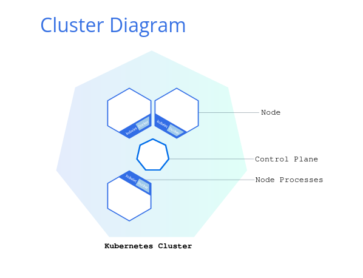

<h1>Inception of Things</h1>

<b>Part one</b>

 

We need to set up two virtual machines with *vagrant*:
<ul>
	<li>first one as <b>Server</b> (-> sufixed with 'S')</li>
	<li> second as <b>Server Worker</b> (-> sufixed with 'SW')</li>
</ul>

We must have dedicated IP on <b>eth1</b> interface:
<ul>
	<li>Server will be on <b>192.168.56.110</b></li>
	<li>Worker will be on <b>192.168.56.111</b></li>
</ul>

We also must be able to connect with ssh on both machine with <b>no password</b>.

After doing that, we have to setup k3s cluster: 
 

 

<b>Part two</b>

<h2><a href="https://kubernetes.io/fr/">Kubernetes</a></h2>

We have to install <b>K3s</b> respectively in <b>controller mode</b> and <b>agent mode</b> (server and worker).

<b>Part three</b>

<b>Resources</b>

<ul>
	

		
Vagrant

		<ul>
			<li><a href="https://www.vagrantup.com/">Vagrant</a></li>
			<li><a href="https://developer.hashicorp.com/vagrant/docs/vagrantfile">vagrantfile</a></li>
		</ul>
	

	

		
Kubernetes

		<ul>
			<li><a href="https://kubernetes.io/fr/docs/tasks/tools/install-kubectl/">kubectl<a>
		</ul>
	

</ul>

